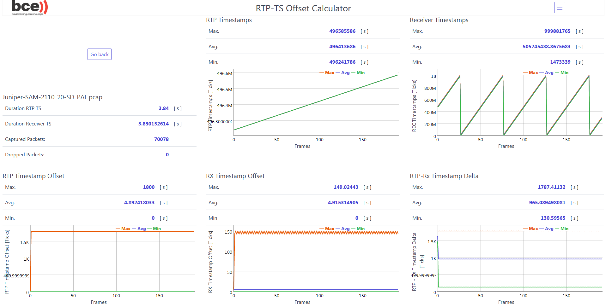

# RTP-TS-Offset-calculator

This Calculator is able to parse PCAP files to analyze RTP video streams.
It has been tested with 2110 and 2022-6 streams. What can it do:

* Display the RTP timestamps
* Display the receiver timestamps
* Calculate and display the offset between a RTP timestamp to its previous
timestamp
* Calculate and display the offset between a receiver timestamp to its previous
timestamp
* Calculate the time a packet needed to get from the sender to the receiver
* Detect RTP sequence errors and show how many packets are lost.

As an alternative the time from the sender to the receiver can be calculated
manually by typing in the RTP timestamp and the receiver timestamp of a single packet.

## Usage
To use this tool, simply download the zip or clone this directory and open the index.html with your browser.

After the application started, either drag and and drop or upload a PCAP file, or enter manual values to quickly check the timestamp delta of a single packet.

Select the right clock speed in the popup window. After the file has been analyzed click on a chart to open a detailed view. To zoom in to a chart, drag a rectangle over it. To reset the chart, right click.

For more information about the different charts, hover with the mouse over the respective heading and click on the button "more" to get to the documentation page.

___

### ATTENTION! Memory hungry application!

Pay attention to the RAM of your machine, as the pcap files are directly loaded to it. When using big files, it is possible that the RAM gets full fast, as the JavaScript garbage collector, responsible for removing unused data from the memory, can't be triggered manually. To free memory, close the tab and open the application again.

___

## Third party
The tool uses local copies of [jQuery](https://jquery.com/) for convenient DOM manipulation, [Spectre.css](https://picturepan2.github.io/spectre/index.html) for the look and the [BigNumber](http://jsfromhell.com/classes/bignumber) script by Jonas Raoni Soares Silva to prevent a value overflow during offset calculation.

## Info
This tool was developed during an internship at the Broadcasting Center Europe [BCE](https://www.bce.lu/) by me, Fabian Schöttler. The application is free software and published under a BSD3 License. Copyright holder: Broadcasting Center Europe
